# When "Keep It Simple" Isn't Simple

## The Collapse of Abstractions

**NeMo Guardrails Architecture Analysis** | December 2024

---

## The Promise (May 2023)

### GitHub Issue #30

> "Is it possible to use this without langchain?"
> — Auto-GPT Team

**The Official Response:**

> "The core nemoguardrails functionality only uses a **limited set of features** from langchain e.g. `PromptTemplate`, `LLMChain` and `LLM` implementations."

**Screenshot of Issue #30:**

<!-- Add your screenshot here -->


---

## The Reality: 18 Months Later

### From "limited" to pervasive

| Metric | May 2023 (v0.2.0) | Dec 2024 (v0.19.0) | Change |
|--------|-------------------|-------------------|--------|
| Files with LangChain | 16 | 31 | **+94%** |
| Import statements | 34 | 61 | **+79%** |
| LangChain packages | 1 | 5 | **+400%** |
| Unique modules | ~13 | ~25 | **+92%** |

```mermaid
xychart-beta
    title "LangChain Coupling Growth"
    x-axis [Files, Imports, Packages, Modules]
    y-axis "Count" 0 --> 70
    bar [16, 34, 1, 13]
    bar [31, 61, 5, 25]
```

---

## The 5 LangChain Packages

What started as **one** dependency:

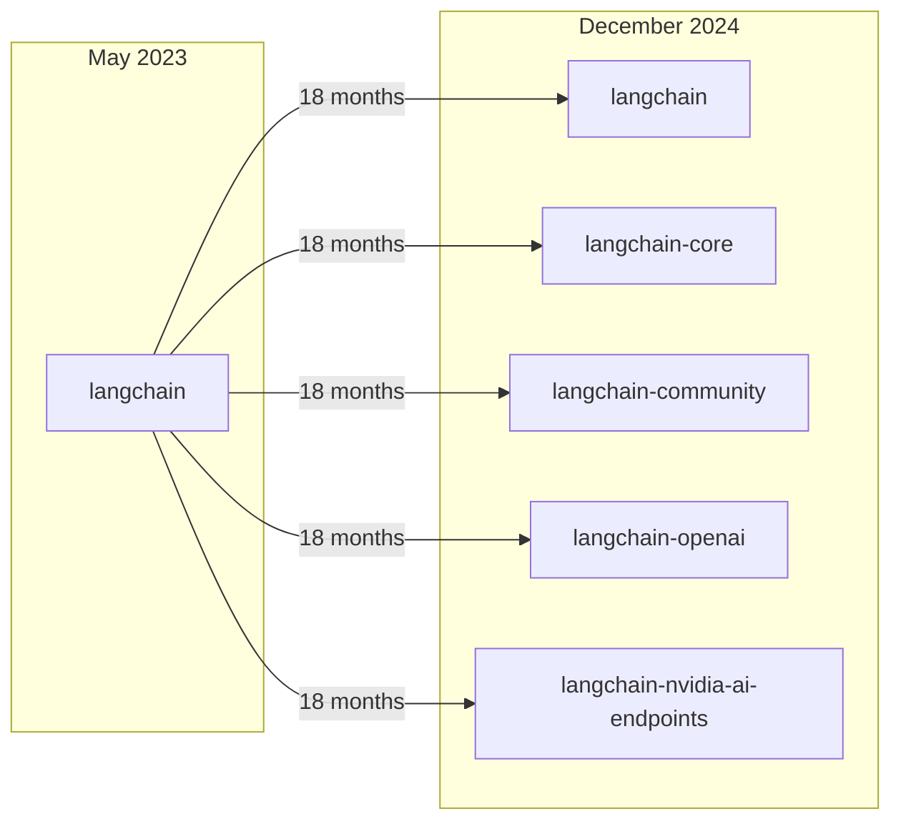

**Every LangChain breaking change = our breaking change.**

---

## LangChain in Our Public API

Users **MUST** use LangChain types:

```python
# nemoguardrails/rails/llm/llmrails.py

from langchain_core.language_models import BaseChatModel, BaseLLM

class LLMRails:
    llm: Optional[Union[BaseLLM, BaseChatModel]]  # LangChain type!

    def __init__(
        self,
        config: RailsConfig,
        llm: Optional[Union[BaseLLM, BaseChatModel]] = None,  # LangChain!
    ):
```

> **Want to use NeMo Guardrails without LangChain? You can't.**

---

## The Cost of Decoupling

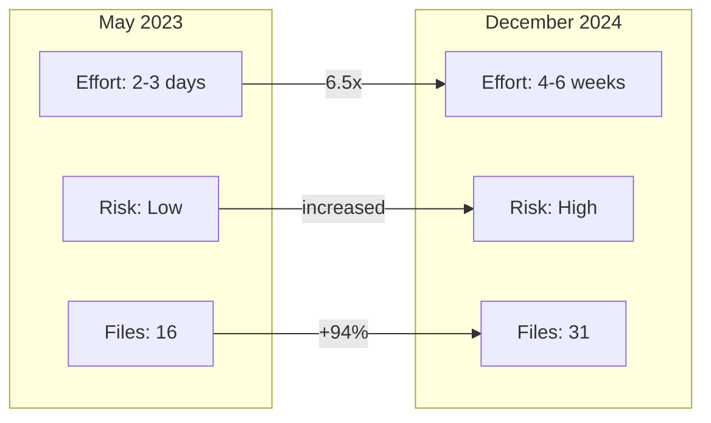

| When | Effort | Risk |
|------|--------|------|
| **May 2023** | ~2-3 days | Low |
| **Dec 2024** | ~4-6 weeks | High |

### Cost multiplier: 6.5x

> The abstraction tax is a one-time cost.
> The coupling tax is paid forever.

---

## The God Classes

Two files, **~3,500 lines** combined:

| Class | Lines | Responsibilities |
|-------|-------|------------------|
| **LLMRails** | 1,756 | 10+ distinct concerns |
| **RailsConfig** | 1,805 | 6+ distinct concerns |

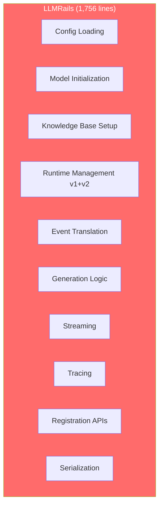

**Single Responsibility Principle?** What's that?

---

## The Config Loading Leak

### RailsConfig should arrive complete. But...

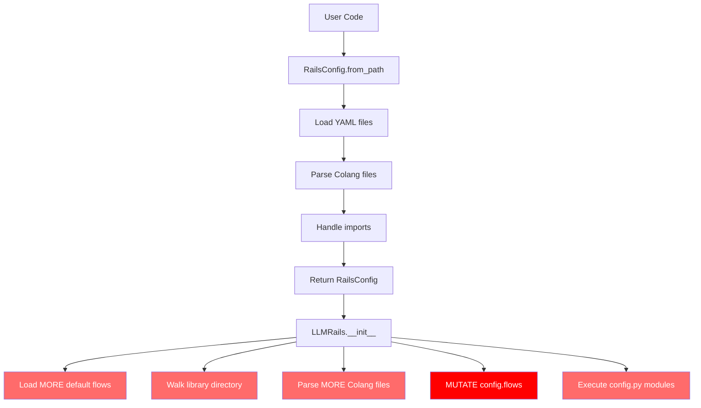

**The consumer of config should not load more config.**

---

## The Mutation Problem

```python
# Watch this:
config = RailsConfig.from_path("/path/to/config")
print(len(config.flows))  # 10 flows

rails = LLMRails(config)
print(len(config.flows))  # 50 flows - IT CHANGED!
```

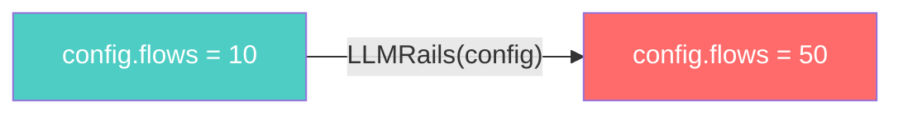

> The config you passed in is not the config being used.

---

## The Testing Nightmare

To test `LLMRails.generate_async()`, you must mock:

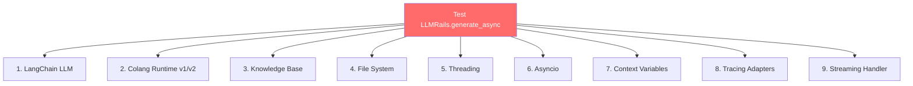

### 9 mocks for 1 test. Is this "simple"?

---

## The Irony: We Did It Right for Embeddings

```python
# nemoguardrails/embeddings/providers/base.py

class EmbeddingModel(ABC):
    """Our own abstraction - no LangChain types!"""

    @abstractmethod
    async def encode_async(self, documents: List[str]) -> List[List[float]]:
        raise NotImplementedError()
```

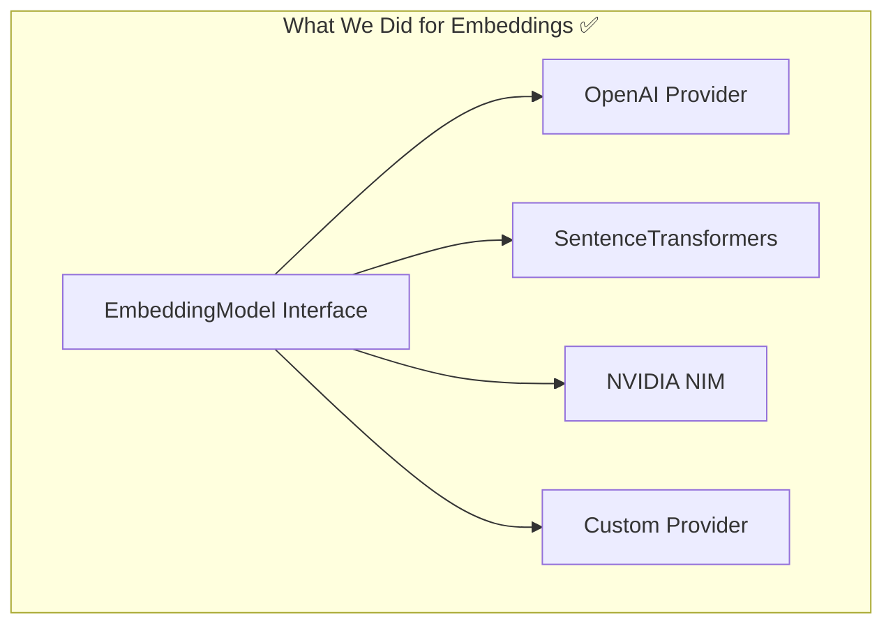

**This enables:** Multiple implementations, easy testing, user freedom, version independence.

### Why didn't we do this for LLMs?

---

## What Should Exist

### The missing abstraction (30 lines of code)

```python
# nemoguardrails/llm/interfaces.py

class LLMProvider(Protocol):
    """Our own LLM abstraction."""
    async def generate(self, prompt: str, **kwargs) -> str: ...
    async def generate_stream(self, prompt: str, **kwargs) -> AsyncIterator[str]: ...

class ChatProvider(Protocol):
    """Our own Chat abstraction."""
    async def chat(self, messages: List[Message], **kwargs) -> Message: ...
```

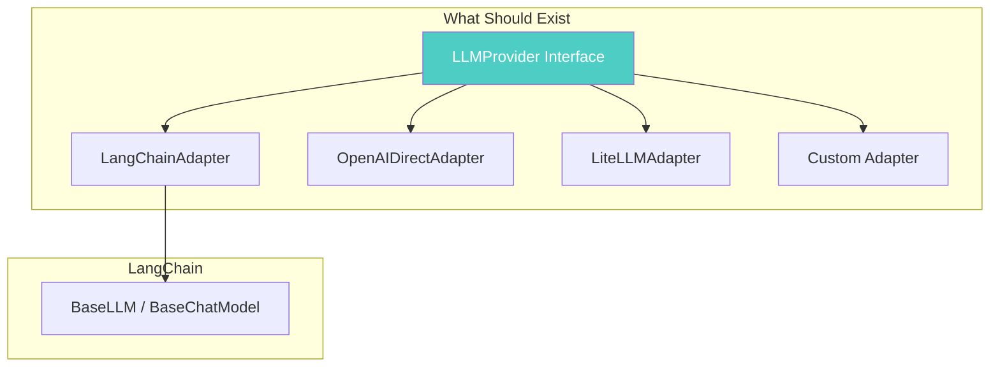

**User choice. Our independence.**

---

## Dead Code in Production

```python
# nemoguardrails/rails/llm/llmrails.py - line 285

if True or check_sync_call_from_async_loop():
    t = threading.Thread(target=asyncio.run, args=(self._init_kb(),))
    t.start()
    t.join()
else:
    loop.run_until_complete(self._init_kb())  # UNREACHABLE!
```

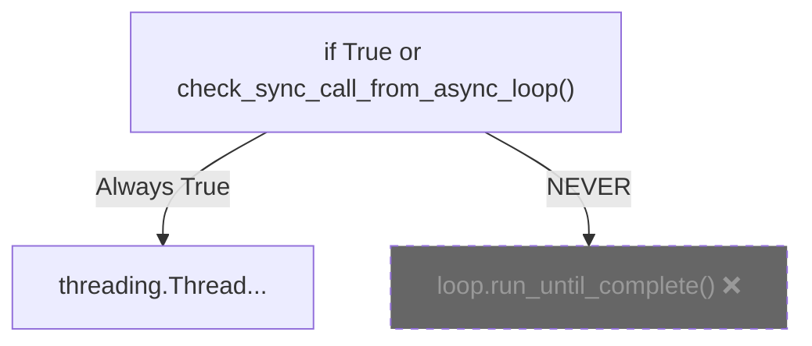

**The else branch can never execute.**

---

## The KISS Misunderstanding

| Interpretation | Result |
|----------------|--------|
| **Wrong:** "No abstractions" | Growing complexity, tight coupling |
| **Right:** "Right abstractions" | Stable interfaces, loose coupling |

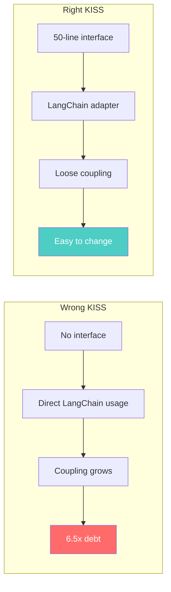

> A 50-line interface that prevents 6.5x debt? **That IS simple.**

---

## The Refactoring Issues

### #1149 and #1150 - Both closed "Not Planned"

**Issue #1150: Split out LLMRails**
- Proposed 7 focused components
- Identified dead code, global state, testing burden
- **Status: Closed**

**Issue #1149: Split out LLMGenerationActions**
- Identified tangled architecture
- Proposed separation of concerns
- **Status: Closed**

> The problems are documented. The solutions are known. The will is missing.

---

## Key Takeaways

1. **"Limited features" grows** — 34 → 61 imports, 1 → 5 packages

2. **Coupling compounds** — 6.5x cost increase in 18 months

3. **God Classes emerge** — 3,500 lines, 16+ responsibilities

4. **Config loading leaks** — LLMRails mutates the config it receives

5. **Testing becomes impossible** — 9 mocks for one test

6. **We knew how to do it right** — EmbeddingModel proves it

7. **KISS ≠ No Abstractions** — Right abstractions ARE simple

---

## How Technical Debt Accumulates

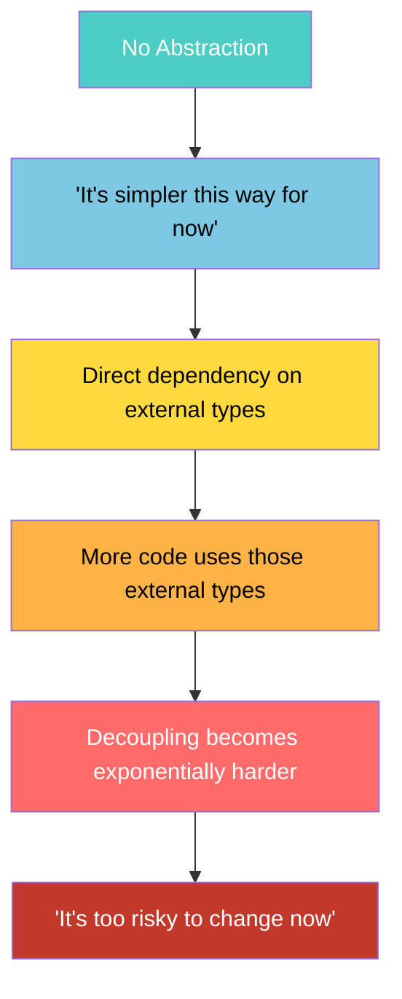

---

## Resources

- **Full LangChain Analysis:** [when-keep-it-simple-isnt-simple.md](when-keep-it-simple-isnt-simple.md)
- **LLMRails/RailsConfig Analysis:** [llmrails-railsconfig-analysis.md](llmrails-railsconfig-analysis.md)
- **GitHub Issue #30:** [Original LangChain dependency discussion](https://github.com/NVIDIA/NeMo-Guardrails/issues/30)
- **GitHub Issue #1149:** [Split out LLMGenerationActions](https://github.com/NVIDIA/NeMo-Guardrails/issues/1149)
- **GitHub Issue #1150:** [Split out LLMRails](https://github.com/NVIDIA/NeMo-Guardrails/issues/1150)

---

<div align="center">

### The cost of missing abstractions is paid in perpetuity.

</div>
