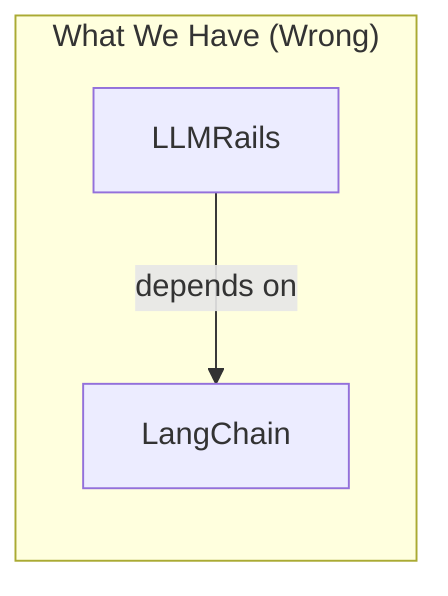
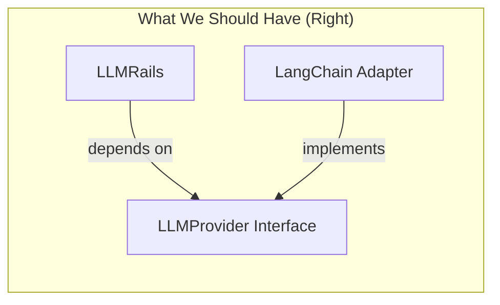
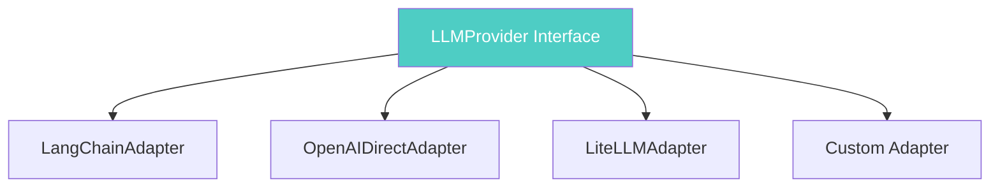
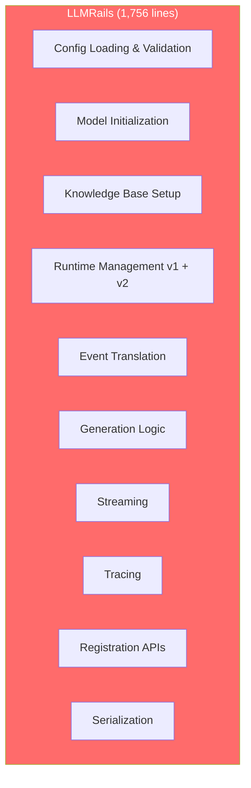
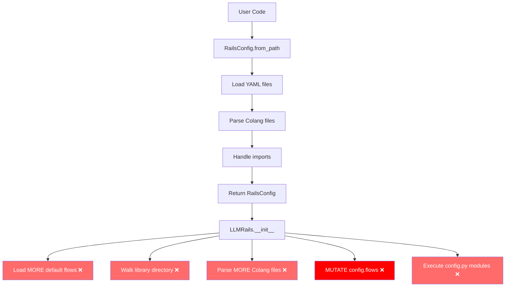
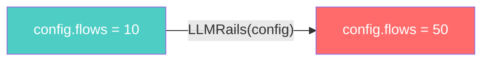
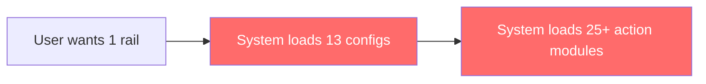
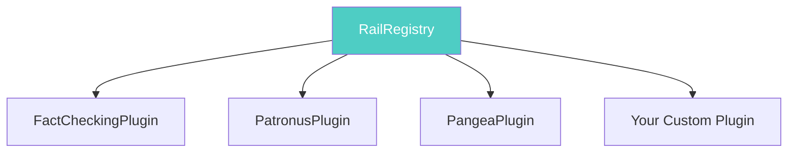

# When "Keep It Simple" Isn't Simple

## The Collapse of Abstractions

---

---

# Part 1: LangChain Coupling

## How "Limited Features" Became Deep Dependency

---

## The Original Request

### GitHub Issue #30 (May 25, 2023)

**Title:** *"Is it possible to use this without langchain?"*

> "Our arch won't be Langchain dependent but guardrails would remain valuable."
> — Auto-GPT Team

The Auto-GPT team criticized LangChain's:

- Complexity
- Performance overhead
- Architectural approach

**The core ask:** Can we use NeMo Guardrails without being forced to use LangChain?

---

## The Response: "Limited Set of Features"

### The Official Response (May 30, 2023)

> "Unfortunately, it is not possible to remove the langchain dependency. However, the core nemoguardrails functionality **only uses a limited set of features** from langchain e.g. `PromptTemplate`, `LLMChain` and `LLM` implementations."

This response embodies a common pattern:

1. Acknowledge the coupling exists
2. Minimize its extent ("only a limited set")
3. Implicitly suggest it's not worth addressing

**The implied reasoning:** Creating abstractions would be over-engineering. KISS says keep it simple.

---

## Understanding the Principles

### KISS (Keep It Simple, Stupid)

**Definition:** Systems work best when they are kept simple rather than made complex.

**Common Misapplication:** Using KISS to justify avoiding all abstractions, treating "no abstraction" as inherently simpler than "right abstraction."

**The Truth:** KISS is about avoiding *unnecessary* complexity, not *all* structure. A well-designed abstraction that prevents future coupling IS the simpler solution.

---

### Dependency Inversion Principle (DIP)

**Definition:** High-level modules should not depend on low-level modules. Both should depend on abstractions.





---

### The False Trade-off

| Approach | Perceived | Reality |
|----------|-----------|---------|
| No abstraction | "Simple" | Technical debt compounds over time |
| Right abstraction | "Over-engineering" | One-time cost, prevents debt |

---

## The Metrics: Then vs Now

### May 2023 (v0.2.0) - "Limited Set of Features"

| Metric | Value |
|--------|-------|
| Files with LangChain imports | 16 (27% of codebase) |
| Total import statements | 34 |
| Unique LangChain modules | ~13 |
| LangChain packages required | 1 |
| Lines in llmrails.py | 213 |

---

### December 2024 (v0.19.0) - The Reality

| Metric | Value | Growth |
|--------|-------|--------|
| Files with LangChain imports | 31 | +94% |
| Total import statements | 61 | +79% |
| Unique LangChain modules | ~25 | +92% |
| LangChain packages required | 5 | +400% |
| Lines in llmrails.py | 1,756 | +724% |

```mermaid
xychart-beta
    title "LangChain Coupling Growth"
    x-axis ["Files", "Imports", "Packages", "Modules"]
    y-axis "Count" 0 --> 70
    bar [16, 34, 1, 13]
    bar [31, 61, 5, 25]
```



---

### The 5 LangChain Packages

```toml
langchain = ">=0.2.14,<2.0.0"
langchain-core = ">=0.2.14,<2.0.0"
langchain-community = ">=0.2.5,<2.0.0"
langchain-openai = { version = ">=0.1.0", optional = true }
langchain-nvidia-ai-endpoints = { version = ">= 0.2.0", optional = true }
```

**Every LangChain breaking change = our breaking change.**

---

## Code Evidence: The Coupling Problem

### Problem 1: LangChain Types in Public API

```python
# nemoguardrails/rails/llm/llmrails.py

from langchain_core.language_models import BaseChatModel, BaseLLM

class LLMRails:
    llm: Optional[Union[BaseLLM, BaseChatModel]]  # LangChain type!

    def __init__(
        self,
        config: RailsConfig,
        llm: Optional[Union[BaseLLM, BaseChatModel]] = None,  # LangChain!
    ):
```

**Impact:** Users MUST use LangChain types. No way to use NeMo Guardrails with a non-LangChain LLM client.

---

### Problem 2: Provider Registry Bound to LangChain

```python
# nemoguardrails/llm/providers/providers.py

_llm_providers: Dict[str, Type[BaseLLM]] = {...}
_chat_providers: Dict[str, Type[BaseChatModel]] = {...}

def register_llm_provider(name: str, provider_cls: Type[BaseLLM]):
    # Provider MUST inherit from LangChain's BaseLLM
    _llm_providers[name] = provider_cls
```

**Impact:** Custom providers MUST inherit from LangChain base classes.

---

### Problem 3: Every Action Depends on LangChain

```python
# nemoguardrails/library/self_check/facts/actions.py
async def check_facts(llm: Optional[BaseLLM] = None, ...):
    ...

# nemoguardrails/library/hallucination/actions.py
async def check_hallucination(llm: BaseLLM, ...):
    ...

# nemoguardrails/library/content_safety/actions.py
async def check_jailbreak(llms: Dict[str, BaseLLM], ...):
    ...

# And 7 more action files...
```

**Impact:** All built-in safety rails require LangChain LLMs.

---

## The Irony: We Did It Right for Embeddings

```python
# nemoguardrails/embeddings/providers/base.py

class EmbeddingModel(ABC):
    """Generic interface for an embedding model."""

    @abstractmethod
    async def encode_async(self, documents: List[str]) -> List[List[float]]:
        raise NotImplementedError()
```

**This enables:**

- Multiple implementations (OpenAI, SentenceTransformers, NIM)
- Easy testing (mock the interface)
- User freedom (bring your own)
- Version independence

**Why did we create a proper abstraction for `EmbeddingModel` but not for `LLMProvider`?**

---

## What Proper Abstractions Would Look Like

### Our Own Interface

```python
# nemoguardrails/llm/interfaces.py

class LLMProvider(Protocol):
    """NeMo Guardrails' own LLM abstraction."""

    async def generate(self, prompt: str, **kwargs) -> str:
        ...

class ChatProvider(Protocol):
    """NeMo Guardrails' own Chat abstraction."""

    async def chat(self, messages: List[Message], **kwargs) -> Message:
        ...
```

**30 lines of code.**

---

### LangChain as ONE Adapter

```python
# nemoguardrails/llm/adapters/langchain.py

class LangChainAdapter(LLMProvider):
    """LangChain is just ONE implementation."""

    def __init__(self, llm: BaseLLM):
        self._llm = llm

    async def generate(self, prompt: str, **kwargs) -> str:
        return await self._llm.ainvoke(prompt, **kwargs)
```



**User choice. Our independence.**

---

# Part 2: LLMRails - The God Class

## When One Class Does Everything

---

## The Numbers

| Metric | v0.2.0 (May 2023) | v0.19.0 (Dec 2024) | Growth |
|--------|-------------------|-------------------|--------|
| Lines of code | 213 | 1,756 | +724% |
| Methods | ~10 | 30+ | +200% |
| Responsibilities | ~3 | 10+ | +233% |

---

## What LLMRails Does (All of It)



**Single Responsibility Principle?** What's that?

---

## Why This Is Bad

### 1. Hard to Test

To test `LLMRails.generate_async()`, you must mock:

1. LangChain LLM
2. Colang Runtime (v1 or v2)
3. Knowledge Base
4. File System
5. Threading
6. Asyncio
7. Context Variables
8. Tracing Adapters
9. Streaming Handler

**9 mocks for 1 test.**

---

### 2. Hard to Extend

Want to add a new feature? You'll touch:

- The 170-line `__init__` method
- Multiple generation methods
- Event translation logic
- Possibly streaming
- Definitely tests

**Everything is coupled to everything else.**

---

### 3. Hard to Reason About

```python
def __init__(self, config: RailsConfig, llm: Optional[...] = None, ...):
    # 170+ lines of initialization
    # - File I/O
    # - Directory walking
    # - Dynamic imports
    # - Threading
    # - Config mutation
    # - Runtime creation
    # - KB initialization
    # - Hook execution
```

**Can you predict what happens when you instantiate this class?**

---

## The Config Loading Leak

### The Problem: LLMRails loads config that RailsConfig should have loaded



---

## The Mutation Problem

```python
config = RailsConfig.from_path("/path/to/config")
print(len(config.flows))  # 10 flows

rails = LLMRails(config)
print(len(config.flows))  # 50 flows - IT CHANGED!
```



**The config you passed in is not the config being used.**

---

# Part 3: RailsConfig - Core vs Plugin

## When Everything Is Hardcoded

---

## 13 Third-Party Integrations in Core

```python
class RailsConfigData(BaseModel):
    fact_checking: FactCheckingRailConfig
    autoalign: AutoAlignRailConfig
    patronus: Optional[PatronusRailConfig]
    sensitive_data_detection: Optional[SensitiveDataDetection]
    jailbreak_detection: Optional[JailbreakDetectionConfig]
    injection_detection: Optional[InjectionDetection]
    privateai: Optional[PrivateAIDetection]
    fiddler: Optional[FiddlerGuardrails]
    clavata: Optional[ClavataRailConfig]
    pangea: Optional[PangeaRailConfig]
    guardrails_ai: Optional[GuardrailsAIRailConfig]
    trend_micro: Optional[TrendMicroRailConfig]
    ai_defense: Optional[AIDefenseRailConfig]
```

**13 third-party vendors baked into core config.**

---

## What Happens When You Add "AcmeSecurity"?

**Steps required:**

1. Create `AcmeSecurityConfig` class in config.py
2. Add field to `RailsConfigData`
3. Modify core validation logic
4. Update core tests
5. Wait for core release cycle
6. Cannot distribute independently

**The system is CLOSED for extension without modification of core.**

---

## Loading Everything, Using Nothing

```python
# At startup, regardless of what you use:

# All 13 Pydantic config models instantiated
# All default factories called
# All validation runs
# Memory allocated for unused integrations
```



**Using just `fact_checking`?** Still loads all 13 configs.

---

## Action Loading: The Other Half

```python
# action_dispatcher.py
for root, dirs, files in os.walk(library_path):
    if "actions" in dirs or "actions.py" in files:
        self.load_actions_from_path(Path(root))
```

**What this does:**

- Walks through ALL 25+ library plugins
- Loads EVERY `actions.py` file found
- Executes module code to discover @action decorators
- **Ignores what user actually configured**

---

## The Loading Chain

```mermaid
flowchart TD
    A[User: "I just want input rails"] --> B[RailsConfig.from_path]
    B --> C["Load all 13 config classes"]
    C --> D[LLMRails.__init__]
    D --> E["Walk library directory"]
    E --> F["Load 25+ action modules"]
    F --> G["Mutate config with all flows"]
    G --> H["Finally ready"]

    style C fill:#ffcc00,color:#000
    style E fill:#ff6b6b,color:#fff
    style F fill:#ff6b6b,color:#fff
    style G fill:#ff0000,color:#fff
```

---

## What a Plugin System Would Look Like

```python
class RailPlugin(ABC):
    def get_name(self) -> str: ...
    def get_config_schema(self) -> Type[BaseModel]: ...
    def get_actions(self) -> List[Callable]: ...

class RailRegistry:
    def register(self, plugin: RailPlugin) -> None: ...
    def get(self, name: str) -> Optional[RailPlugin]: ...

# Third-party can distribute independently:
# pip install nemoguardrails-patronus
```



---

# Lessons Learned

---

## Lesson 1: "Limited" Coupling Grows

The May 2023 claim of "limited set of features":

- `PromptTemplate` → Now also `ChatPromptValue`, `StringPromptValue`
- `LLMChain` → Replaced by `Runnable` system (6 new classes)
- `LLM implementations` → Now 5 packages, 25+ modules

**Coupling is not static. It grows.**

---

## Lesson 2: KISS Misapplication

KISS was used to justify:

- Not creating interfaces ("extra code")
- Not creating adapters ("unnecessary abstraction")
- Using external types directly ("simpler")

**Result:** We now have 396 lines in `langchain_initializer.py` just to handle initialization complexity.

**True KISS:** A 50-line interface would have been genuinely simpler.

---

## Lesson 3: External Dependencies Mutate

LangChain underwent:

- Package split (`langchain` → `langchain-core`, `langchain-community`)
- API changes (`LLMChain` → `Runnable`)
- Class reorganization
- Multiple breaking changes

**Each change required updates throughout our codebase** because we had no abstraction boundary.

---

## Lesson 4: Public API Coupling is Hardest to Fix

```python
# This is in our public API:
def __init__(self, llm: Optional[BaseLLM] = None):
```

Users have code like:

```python
from langchain_openai import ChatOpenAI
rails = LLMRails(config, llm=ChatOpenAI())
```

**We cannot change the type hint without breaking users.**

---

## Lesson 5: The Abstraction Tax is One-Time

**Creating an abstraction:**

- Upfront cost: Hours to days
- Ongoing cost: Nearly zero

**Not creating an abstraction:**

- Upfront cost: Zero
- Ongoing cost: Grows forever

---

# Key Takeaways

1. **"Limited features" grows** — 34 → 61 imports, 1 → 5 packages

2. **God Classes emerge** — 1,756 lines, 10+ responsibilities

3. **Core vs Plugin matters** — 13 integrations shouldn't be in core

4. **Config loading leaks** — LLMRails mutates what it receives

5. **We knew how to do it right** — EmbeddingModel proves it

6. **KISS ≠ No Abstractions** — The right abstraction IS simple

---

<div align="center">

## The cost of missing abstractions is paid in perpetuity

</div>

---

## Resources

- [LangChain Analysis](when-keep-it-simple-isnt-simple.md)
- [LLMRails/RailsConfig Analysis](llmrails-railsconfig-analysis.md)
- [GitHub Issue #30](https://github.com/NVIDIA/NeMo-Guardrails/issues/30)
- [GitHub Issue #1149](https://github.com/NVIDIA/NeMo-Guardrails/issues/1149)
- [GitHub Issue #1150](https://github.com/NVIDIA/NeMo-Guardrails/issues/1150)
