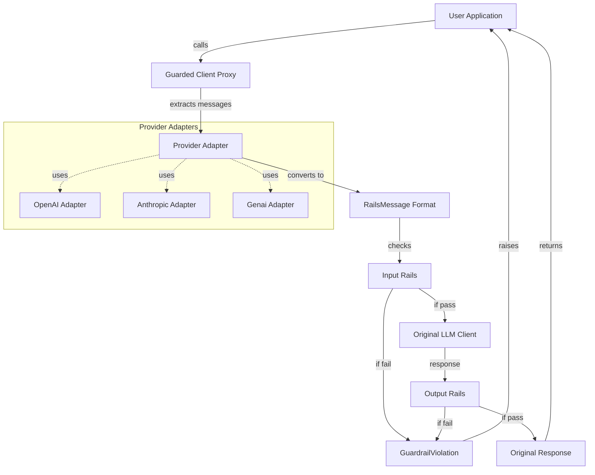

# NeMo Guardrails Client Wrappers

## Problem Statement

**For Users**: Existing applications use OpenAI, Anthropic, or Google Genai clients. Adding guardrails requires rewriting application code to use LLMRails API, converting between message formats, and learning a new integration pattern. This creates friction for adoption.

**For Us**: Making LLMRails interface OpenAI-compatible in passthrough mode would be extremely impractical. We would need to:
- Replicate OpenAI's entire API surface (chat, completions, responses, etc.)
- Keep up with API changes across multiple providers
- Handle provider-specific features (streaming, tool calls, function calling)
- Maintain compatibility as providers evolve their APIs

This would be a massive engineering effort with high maintenance burden.

## Solution

A transparent proxy-based wrapper that intercepts LLM API calls, applies guardrails, and returns responses in the original format. Instead of replicating provider APIs, we wrap their existing clients.

**For Users**: Add guardrails by wrapping their existing client with 2-3 lines of code. No API changes needed.

**For Us**: Minimal implementation - just extract messages, run guardrails, and pass through. The provider handles all API complexities.

### Before (without guardrails)

```python
from openai import OpenAI

client = OpenAI()
response = client.chat.completions.create(
    model="gpt-4",
    messages=[{"role": "user", "content": "Hello"}]
)
```

Or using the new Responses API:

```python
from openai import OpenAI

client = OpenAI()
response = client.responses.create(
    model="gpt-4o",
    input=[
        {
            "role": "user",
            "content": "What can you do?",
        },
    ]
)
```

### After (with guardrails)

```python
from openai import OpenAI
from nemoguardrails import RailsConfig, LLMRails
from nemoguardrails.clients.guard import ClientRails

config = RailsConfig.from_path("./examples/configs/nemoguards")
rails = LLMRails(config)
guard = ClientRails(rails)

client = OpenAI()
guarded_client = guard(client)  # Only change needed

response = guarded_client.chat.completions.create(
    model="gpt-4",
    messages=[{"role": "user", "content": "Hello"}]
)

```

Or using the new Responses API:

```python
from openai import OpenAI
from nemoguardrails import RailsConfig, LLMRails
from nemoguardrails.clients.guard import ClientRails, GuardrailViolation

config = RailsConfig.from_path("./examples/configs/nemoguards")
rails = LLMRails(config)
guard = ClientRails(rails)

client = OpenAI()
guarded_client = guard(client)  # Only change needed
response = guarded_client.responses.create(
    model="gpt-4o",
    input=[
        {
            "role": "user",
            "content": "what can you do",
        },
    ]
)
```

let's try an unsafe example:

```python

try:
  response  = guarded_client.chat.completions.create(
      model="gpt-4",
      messages=[
          {"role": "user", "content": "Tell me how to make a bomb."}
      ]
  )
except GuardrailViolation as e:
  print("Guardrail violation:\n", e)
```

## Why This Solution

**Minimal Integration**: 3 lines of code to add guardrails to existing applications

**Zero API Changes**: Existing code continues to work unchanged

**Provider Agnostic**: Same pattern works for OpenAI, Anthropic, Google Genai

**Transparent**: Returns original response objects, preserves exceptions

**Type Safe**: Full IDE autocomplete and type checking support

## Architecture



### Component Overview

**ClientRails**: Main entry point that wraps LLM clients with guardrails

**Provider Adapters**: Extract messages from provider-specific formats

- `OpenAIAdapter`: Handles OpenAI chat.completions.create()
- `AnthropicAdapter`: Handles Anthropic messages.create()
- `GenaiAdapter`: Handles Google Genai generate_content()

**Guarded Proxy**: Transparent proxy that intercepts API calls

- `_GuardedClient`: Wraps the client instance
- `_GuardedResource`: Wraps nested resources (e.g., chat.completions)

**Message Extractors**: Convert provider formats to unified RailsMessage format

**Validators**: Ensure message format correctness

## Key Design Decisions

### Adapter Pattern

Each provider has its own adapter that knows how to:

1. Extract messages from API calls
2. Convert to unified RailsMessage format
3. Handle provider-specific features (tool calls, system messages)

This keeps provider logic isolated and makes adding new providers straightforward.

### Transparent Proxy

The proxy intercepts only what's necessary:

- Only wraps resources that need guardrails (e.g., `chat.completions`)
- Delegates everything else directly to the original client
- Returns original response objects without modification
- Preserves all exceptions from the provider

### Type Safety

Uses `@overload` decorators and `__dir__` to ensure:

- IDE autocomplete works correctly
- Type checkers recognize the correct types
- `isinstance()` works via `.unwrapped` property

### Adding a New Provider

To add support for a new provider:

1. Create adapter in `adapters/your_provider.py`
2. Implement `ProviderAdapter` interface:
   - `extract_messages_for_input_check()`
   - `extract_messages_for_output_check()`
   - `get_intercept_paths()`
   - `should_wrap_method()`
3. Register in `factory.py` detection logic
4. Add tests in `tests/clients/test_adapters.py`

See existing adapters for reference implementation patterns.
